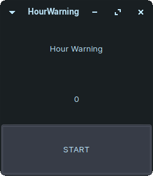

# HourWarning

<p align="center">
  
</p>

<p align="center">
  <a href="https://forthebadge.com">  </a>
  <a href="https://forthebadge.com">  </a>
  <a href="https://forthebadge.com">  </a>
</p>

## :scroll: Sobre

Aviso de que a pessoa precisa descansar a cada 1 hora ao pressionar o botão "START".

Ideia da psicóloga Michelle Carvalho.

---

## :rocket: Tecnologias utilizadas

- HTML
- CSS
- JavaScript (Electron)

---

## :computer: Como baixar e rodar o projeto

```bash
  // Clonar o repositório
  $ git clone https://github.com/jjoaovitor7/HourWarning

  // Entrar no diretório
  $ cd HourWarning

  // Executar o programa (Linux)
  $ ./HourWarning-0.1-beta.AppImage
  // Ou clicar 2 vezes no arquivo
```

---
